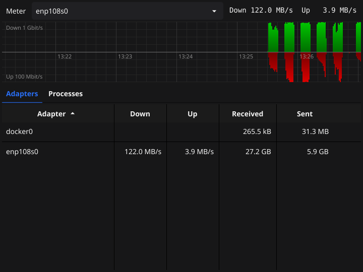
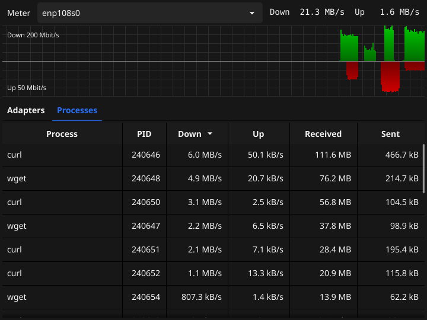

# Fyne UpDown

 

Network traffic monitor that lives in the system tray, written in Go using the
[Fyne](https://fyne.io/) GUI library. It runs on Windows, Linux and macOS and
is inspired by [UpDown Meter](https://github.com/ScriptFUSION/UpDown-Meter) by
ScriptFUSION, a Windows only .NET application.

### Features

The tray icon shows two animated meters, like UpDown Meter does: upload on the
top half and download on the bottom half. Unlike UpDown Meter upload is red and
download green, as uploads are the ones to watch. They are sampled once per
second. The full scale of the meters is the link speed that the
adapter reports. Like in UpDown Meter it can be set per adapter, separately
for download and upload, by clicking the adapter in the Adapters list. Pick a
preset or type a speed in bits per second like 50M, 2.5G or 512k, Auto goes
back to the link speed. Wireless adapters on Linux do not report a link speed,
their meters stay empty until a scale is set.

The window (click Show in the tray menu) has two list views:

- Adapters: the current download and upload speed and the totals of each
  network adapter. The meter shows the adapter selected at the top, Auto picks
  the adapter with the most traffic.
- Processes: the current download and upload speed and the totals of each
  process since the app was started. Traffic that can not be linked to a
  process is listed as "(unknown)".

Closing the window hides it, use Quit in the tray menu to exit.

Blocking and shaping traffic per process is planned for a next version.

### Per-process traffic

The operating systems do not offer per-process traffic counters to normal
users, so each platform has its own implementation:

- Linux: packets are captured on a raw socket and linked to processes via the
  socket tables in /proc, like nethogs does. This needs the capabilities to
  capture packets and to read the file descriptors of other processes:

      sudo setcap cap_net_raw,cap_sys_ptrace,cap_dac_read_search+ep ./fyne-updown

  Without these the Processes tab explains what to run. Note that setcap needs
  to be repeated after every build.
- Windows: the Microsoft-Windows-Kernel-Network ETW provider reports the
  process id and size of every TCP and UDP send and receive. Starting a trace
  session needs administrator rights, so run the app as administrator.
- macOS: the output of the built in `nettop` command is read, this does not
  need extra rights.

On Linux traffic of containers passes the host adapters, but it belongs to
processes in other network namespaces, so it shows up as "(unknown)".

### Building

Install Fyne dependencies:

    sudo apt install golang gcc libgl1-mesa-dev xorg-dev

Install go packages:

    go mod download

Run the application:

    go run .

Note that the first build may take several minutes (!).

### Package using fyne-cross

Install fyne-cross using:

    go install github.com/fyne-io/fyne-cross@latest

Now run the package.sh script to build all binaries. Cross compiling to macOS
needs a copy of the macOS SDK, see the "OSX build" section of the
[fyne-mines](https://github.com/mevdschee/fyne-mines) README.

### Releasing

Bump `Version` in FyneApp.toml, commit and push, then run the release.sh script.
It reads the version, tags the current commit and uploads the six binaries from
fyne-cross/dist as a GitHub release, so run package.sh first.

### Known issues

On GNOME the tray icon is only shown with the AppIndicator extension installed.
